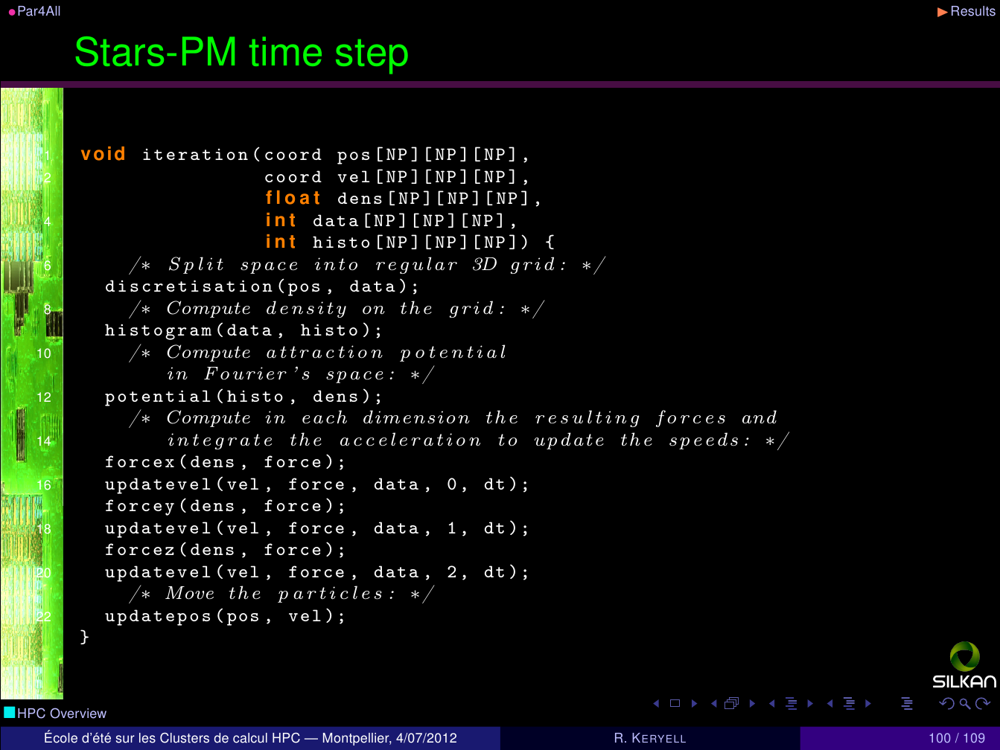
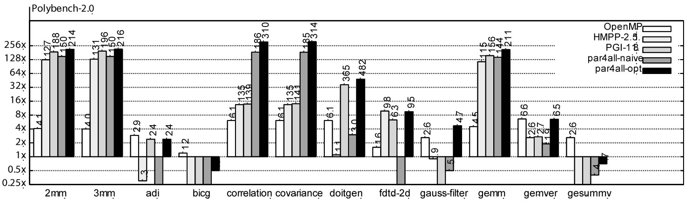
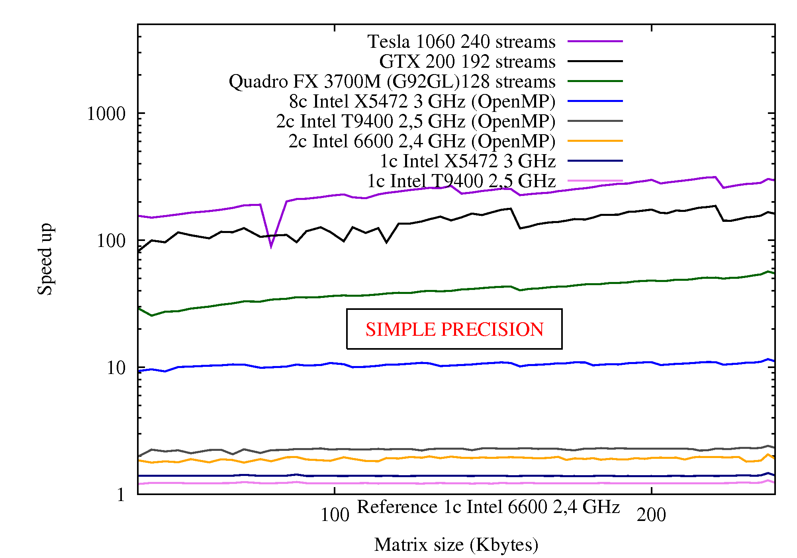

Benchmarks
==========

.. sidebar:: A video demonstration of Par4All

  .. raw:: html

     <iframe width="425" height="344"
             src="http://www.youtube.com/embed/EP8mq0zh4gA?wmode=transparent"
             frameborder="0"
             allowfullscreen>
     </iframe>

We use Par4All to parallelize programs for customers and collaborative
research projects but we have also used Par4All on some benchmarks. Here
are a few results that we are allowed to communicate.

Stars-PM
--------

Stars-PM is a Particle-Mesh N-body cosmological simulation in C code from
the `Observatoire Astronomique de Strasbourg <http://astro.u-strasbg.fr>`_
and uses 3D FFT among other things.

The goal is to model gravitational interactions between particles in
space. The 3D resolution of these interactions is obtained by
interpolation on space discretization.

We use Par4All automatic transformations process to on Stars-PM. The
sequential version was written in C and has been the object of a study to
manually optimize and adapt on GPU.

.. image:: images/benchmarks/Stars-PM-WWW-perf.png
   :width: 50%

Static Compilation Analysis for Host-Accelerator Communication Optimization
---------------------------------------------------------------------------

This graph shows our results on 20 benchmarks from Polybench suite, 3 from
Rodinia, and the application Stars-PM. Measurements were performed on a
machine with 2 Xeon Westmere X5670 (12 cores at 2.93 GHz) and a nvidia
GPU Tesla C2050.

The OpenMP versions used for the experiments are generated automatically
by the parallelizer and are not manually optimized.

.. image:: images/benchmarks/speedup-part2.jpg
   :width: 100%

For more details:

- refer to the `publication « Static Compilation Analysis for
  Host-Accelerator Communication Optimization. »`

- Polybench : http://sourceforge.net/projects/polybench

- Rodinia : http://lava.cs.virginia.edu/wiki/rodinia

Hyantes
-------

Hyantes is a library to compute neighbourhood population potential with
scale control. It is developed by the MESCAL team from the Laboratoire
Informatique de Grenoble (France), as a part of HyperCarte project. The
HyperCarte project aims to develop new methods for the cartographic
representation of human distributions (population density, population
increase, etc.) with various smoothing functions and opportunities for
time-scale animations of maps. Hyantes provides one of the smoothing
methods related to multiscalar neighbourhood density estimation. It is a C
library that takes sets of geographic data as inputs and computes a
smoothed representation of this data taking account of neighbourhood’s
influence.

For more information: http://hyantes.gforge.inria.fr

Results
.......

We measure the wall-clock time that includes startup time, data load time
and output write time, that is the real time understood by users. By
measuring kernel time only, speed-up would be better but less
representative of the real application (Amdahl…).

On a Wild Node with 2 Intel Xeon X5670 @ 2.93GHz (12 cores) and a Tesla
C2050 (Fermi), Linux/Ubuntu 10.04, gcc 4.4.3, CUDA 3.1, we measure in
double precision:

- Sequential execution time on CPU: 30.355s

- OpenMP parallel execution time on CPUs: 3.859s, **speed-up: 7.87**

- CUDA parallel execution time on GPU: 0.441s, **speed-up: 68.8**

To test it by yourself on the main computational part, go to the
examples/P4A/Hyantes directory of Par4All or look in the ``git``
repository
https://github.com/Par4All/par4all/tree/p4a/examples/P4A/Hyantes

For mobile users, it is interesting to show result figures on a laptop:
for the single precision (compiled with make USE_FLOAT=1) on a HP
EliteBook 8730w laptop (with an Intel Core2 Extreme Q9300 @ 2.53GHz (4
cores) and a nVidia GPU Quadro FX 3700M, 16 multiprocessors, 128 cores,
architecture 1.1) with Linux/Debian/sid, gcc 4.4.3, CUDA 3.1:

- Sequential execution time on CPU: 38s

- OpenMP parallel execution time on CPUs: 18.9s, **speed-up: 2.01**

- CUDA parallel execution time on GPU: 1.57s, **speed-up: 24.2**

Hologram simulation
-------------------

Fresnel is a C program from the `Holotetrix <http://www.holotetrix.com>`_
company that simulates Fresnel diffraction in holograms before
manufacturing.

The application has been tested on various architectures:

==============================  =====
Architecture                    Cores
==============================  =====
Intel Core 2 duo E6600 2.4 GHz  2
Intel Core 2 duo T9400 2.5 GHz  2
2 Intel Core 2 X5472 3 GHz      8
2 Intel Nehalem X5570 2.9 GHz   8
nVidia GTX 200                  192
nVidia Tesla C1060              240
nVidia Quadro FX 3700M (G92GL)  128
==============================  =====

The speed-up are normalized with 1 E6600 core as reference and the
computations are done for different hologram sizes for the following
results:

   Performance of Holotetrix Fresnel program on *x*\ 86 and CUDA GPU

SPEC CPU2006 410.bwaves
-----------------------

bwaves is a computational fluid dynamics Fortran program that simulates
blast waves in three dimensional transonic transient laminar viscous flow.

More information on the program itself on
http://www.spec.org/cpu2006/Docs/410.bwaves.html

On a Wild Node, we get a **speed-up of 4.5** with a 2 Intel Xeon X5670 @
2.93GHz (12 cores).

Matrix multiplication
---------------------

The classical Hello World in Fortran can be found in
``examples/F77_matmul_OpenMP`` directory of Par4All or look in the ``git``
repository
https://github.com/Par4All/par4all/tree/p4a/examples/F77_matmul_OpenMP so
you can try by yourself.

On a Wild Node, we get a **speed-up of 12.1** (thanks to cache effects)
with a 2 Intel Xeon X5670 @ 2.93GHz (12 cores).

..
  # Some Emacs stuff:
  ### Local Variables:
  ### mode: rst,flyspell
  ### ispell-local-dictionary: "american"
  ### End:
