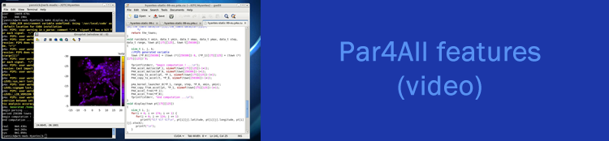

News and events
===============

2012/05/17: HPC Project launches the 1.4 version of Par4All
-----------------------------------------------------------

.. image:: images/Par4all-14.jpg
   :width: 100%

HPC Project introduces the 1.4 version of Par4All open parallelization
platform extending its scope of processing and generating CUDA and OpenCL
code.

This new version introduces enhancements for loop processing for CUDA and
OpenCL kernel generations. Moreover, dependencies resulting from accesses
to global variables are now more finely analyzed to assess parallelism.

Access the press release in :download:`English
<download/20120515-Par4all-1-4-en.pdf>` or :download:`French
<download/20120515-Par4all-1-4-fr.pdf>`.

For more details please consult the :doc:`Features page <features>`.

2012/05/14: GTC 2012
--------------------

.. image:: images/GTC_banniere-750x175.jpg
   :width: 100%

Wild Systems will be at `GTC 2012, the GPU Technology Conference
<http://www.gputechconf.com>`_ from May the 14th to May the 17th in San
José (California).

We will be on booth #41 to present the Wild Cruncher appliance. It allows
Scilab users to automatically take full advantage of the GPU power. We
will also present a beta version of sparse matrix solvers for NVIDIA GPUs
as well as Par4All latest version

2012/01/25: Meetup HPC GPU in Paris
-----------------------------------

.. image:: images/meetup-banniere.jpg
   :width: 100%

On January the 25th 2012, a `Meetup of the HPC GPU supercomputing group
<http://www.meetup.com/HPC-GPU-Supercomputing-Group-of-Paris-Meetup>`_ is
held in the Ecole des Mines de Paris. Par4All and HPC Project will be
present with a talk by Ronan Keryell on automatic parallelization of C and
Fortran for multicores and GPU.

2012/01/13: Wild Cruncher Breakfast February 14th
-------------------------------------------------

.. image:: images/bandeau.-Pt-dej-Wild-Cruncher.jpg
   :width: 100%
   :target: http://hpc-project.com/2012/01/13/wild-cruncher-breakfast-february-14th

..
  This link does not work if changed to silkan.com...

More in formation on
http://hpc-project.com/2012/01/13/wild-cruncher-breakfast-february-14th

2011/08/07: Par4All 1.2 is out
------------------------------

The new version of Par4All 1.2 has been published on 07/08/2011.

Here is the changelog:

**Par4All 1.2**

- This version targets mainly the Wild Cruncher, a parallelizing
  environment from HPC Project for Scilab programs. Par4All is used to
  parallelize the output of the Scilab-to-C compiler from HPC Project

- Added in examples/Benchmarks some benchmark examples we use in our
  publications so that anybody can verify Par4All performance on them
  with own hardware

- Improved support for CUDA atomic update for reductions

- Better deal with scalars in GPU parallelization

- Improved memory effect analysis

- Fixed outlining for kernel generation with scalar parameters

- Improved loop fusion, deal with local variable declarations

- Improved array scalarization

- Make package publication more resilient to network failures

- Fixed GPU code generation for non rectangular iteration spaces

- Fixed communication optimization between GPU and CPU

- Added support for CEA SCMP embedded system

- Installation directory can now be changed also after a first
  installation

- Use the broker concept to deal with stubs to manage with non or already
  parallelized libraries

- Now install ``LICENSE.txt``

- Updated to new PyPS interface

- GPU kernel can be outlined in separated source files on demand, for
  OpenCL or use a separate non C99 compiler (CUDA ``nvcc``), at kernel,
  launcher, wrapper grain...

- Fixed compilation flags in ``PIPS/linear`` to avoid recompilation to
  fail when an API changes too much

2011/06/14: HPC Project announces Wild Cruncher
-----------------------------------------------

.. image:: images/Wild-Cruncher-june-20111.png
   :width: 100%

HPC Project announces its new High Performance appliance, Wild Cruncher,
dedicated to numerical simulation users.

The primary goal for Wild Cruncher is to bridge the gap between
prototyping and production phases for system engineering. This is made
possible through code analysis and optimization technologies on which HPC
Project has based its success.

For more information the press announce in :download:`English
<download/CP-CR-en.pdf>` and in :download:`French
<download/CP-WCR-fr.pdf>`.

2011/05/20: Teratec 2011
------------------------

.. image:: images/Banniere_Forum_Teratec_2011_VA-750x147.png
   :width: 100%
   :target: http://www.teratec.eu/gb/forum/index.html

Par4All will be demonstrated on the HPC Booth at the `Teratec Forum
<http://www.teratec.eu/gb/forum/index.html>`_ on June the 28th and 29th of
June 2011. The focus will be on High Performance Computing numerical
design and Simulation. It will take place at the École Polytechnique in
Palaiseau (Paris area).

2011/05/19: Open GPU 8th of June 2011
-------------------------------------

.. image:: images/slidegpu14-700x174.jpg
   :width: 100%
   :target: http://opengpu.net/index.php?option=com_content&view=article&id=154&Itemid=143

On the 8th of June 2011, a `conference on the theme « OPEN GPU : one year
after launching the program »
<http://opengpu.net/index.php?option=com_content&view=article&id=154&Itemid=143>`_
will be held at the Ecole Polytechnique (Palaiseau) in the Amphithéatre
Becquerel.

Ronan Keryell will be presenting  Par4All.

2011/03/18: HPC Project launches v1.1 Par4All
---------------------------------------------

.. image:: images/Annonce-P4a.jpg
   :width: 100%

**Paris, March 18, 2011** – HPC Project introduces the 1.1 version of Par4All
open parallelization platform with automatic code generation for the
NVIDIA GPU based hybrid computing architectures. This version brings a
significant performance improvement on the execution time of the generated
code.

Par4All is the industrial implementation of a technology developed by the
teams of CRI/Mines ParisTech and Télécom Bretagne. Its goal is to allow
industrial users to meet the challenge of multi-cores architectures and
other parallel processors for generic or embedded systems. From a C or
FORTRAN application, Par4All automatically generates a parallel code to
OpenMP or CUDA (compilable on NVIDIA GPU). The generated code is readable
and completely traceable with the original code. The whole process works
like a usual compilation.

The code generated with Par4All version 1.1 is significantly faster at
execution time. This is due to the new static data-flow analyzer. This new
analyzer allows the optimization of the communications between host and
GPU as well as allocations to the GPU. Practical examples of applications
are available on the :doc:`Benchmark page <benchmarks>`.

:emphasis:`HPC Project was established in December 2007. HPC Project is a
pioneer in developing tools and strategies for high performance computing
and code optimization. HPC Project goal is to bring the power of
supercomputer on the engineer’s desk.`

Press contact
  ``roger.marhuenda (at) hpc-project (dot) com``

..

  I've not been able to have this link working in an image target

.. _par4all-video:

2010/12/14: Video showing Par4All features
------------------------------------------

A few explanations on Par4All in a 3mn video

   A few explanations on Par4All in a 3mn video

.. raw:: html

   <iframe width="425" height="344"
           src="http://www.youtube.com/embed/EP8mq0zh4gA?wmode=transparent"
           frameborder="0"
           allowfullscreen>
   </iframe>

2010/12/06: GTC 2010
--------------------

.. image:: images/GTC_banniere-900x210.jpg
   :width: 100%
   :target: http://www.nvidia.com/object/gpu_technology_conference.html

2010 October 20\ :superscript:`th` to 23\ :superscript:`rd`: come to see
the prototype demo at the HPC Project booth at `GTC 2010 in San Jose
<http://www.nvidia.com/object/gpu_technology_conference.html>`_.

2010/12/03: PIPS Tutorial at Bangalore déc
------------------------------------------

.. image:: images/Popp-bangalore.png
   :width: 100%
   :target: http://polaris.cs.uiuc.edu/ppopp10

2010 September 1\ :superscript:`st`: there was the `PIPS tutorial
<http://pips4u.org/doc/tutorial>`_ during the `PPoPP 2010 conference in
Bangalore, India <http://polaris.cs.uiuc.edu/ppopp10>`_.

2010/12/03: Teratec 2010
------------------------

.. image:: images/equations-noir-rectangle.jpg
   :width: 100%
   :target: http://www.teratec.eu

2010 June 15\ :superscript:`th` to 16\ :superscript:`th`: We will be at
the `Ter@tec 2010 Forum <http://www.teratec.eu>`_ at École Polytechnique,
in Palaiseau, from June 15, 2010 08:30 AM to June 16, 2010 06:00 PM).
`Ter@tec <http://www.teratec.eu>`_ is the European Pole of Competence in
high performance digital simulation

2010/12/03: Open GPU Project
----------------------------

2010 March 25\ :superscript:`th`: `Kick off of the OpenGPU project
<http://www.association-aristote.fr/doku.php/public/seminaires/seminaire-2010-03-25>`_
(from Mar 25, 2010 08:30 AM to Mar 25, 2010 08:00 PM).

2010/12/03: Nvidia GTC 2009
---------------------------

.. image:: images/ImageP4A-2-1024x204.jpg
   :width: 100%
   :target: http://www.gputechconf.com/object/gtc2009-on-demand.html

2009 September 30\ :superscript:`th` to October 2\ :superscript:`nd`:
`Nvidia GTC in San José
<http://www.gputechconf.com/object/gtc2009-on-demand.html>`_ (Fairmont San
Jose 170 South Market Street San Jose, CA 95113, from Sep 30, 2009 12:00
AM to Oct 02, 2009 12:00 AM).

..
  # Some Emacs stuff:
  ### Local Variables:
  ### mode: rst,flyspell
  ### ispell-local-dictionary: "american"
  ### End:
